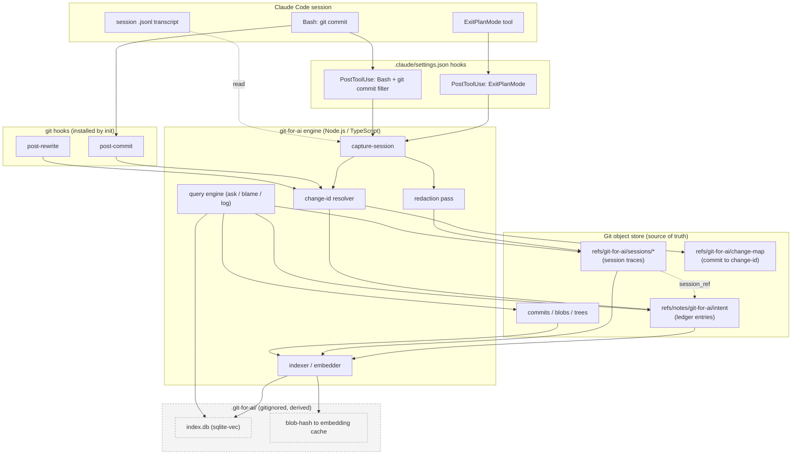
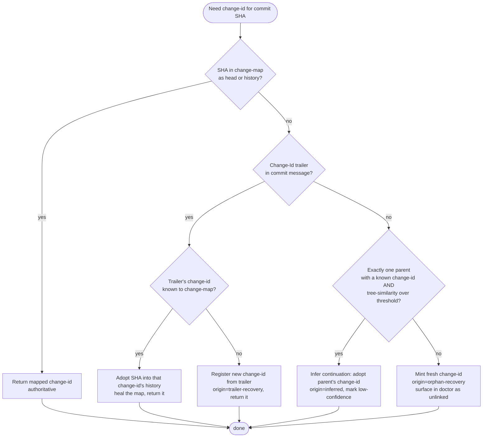
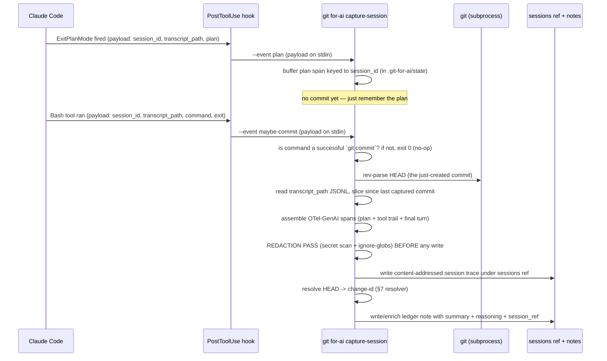
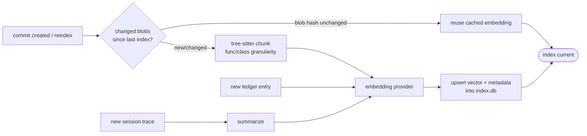

# git-for-ai — Technical Architecture

> Status: **Design spec (pre-implementation).** This is the entry-point document. It is complete
> and coherent on its own for the core architecture. Two supporting files add depth without being
> required reading:
>
> - [`DATA_MODEL.md`](./DATA_MODEL.md) — exhaustive field-by-field schema definitions and worked
>   examples for every record type.
> - [`CLI_REFERENCE.md`](./CLI_REFERENCE.md) — full command reference: every flag, exit code, and
>   example output.
> - [`MONOREPO_PLAN.md`](./MONOREPO_PLAN.md) — how this engine sits inside a monorepo alongside a
>   desktop app, a hosting/server component, and (future) a website.
>
> Grounding documents (read for context, not restated here): [`../research/landscape.md`](../research/landscape.md)
> (prior art) and [`../ideas/00-overview.md`](../ideas/00-overview.md) plus `../ideas/01`–`06`
> (the scoped ideas this synthesizes).
>
> **Revision note:** this document was originally drafted with Rust as the implementation
> language. The project owner has no Rust experience and deep, current .NET/SQL Server/Postgres
> expertise plus a React/Node background — so the language was changed to **TypeScript/Node.js**
> to keep the codebase actually readable and maintainable by its one maintainer. Everything about
> the *design* below (data model, storage layout in git, the identity/rewrite-survival algorithm,
> the CLI surface, privacy model) is language-agnostic and unchanged. Only §4.1 (git access
> strategy) and §11.3 (embedding provider) were language-specific and have been rewritten for
> Node.js; they're the only two sections where "how do I actually build this" materially changed.

---

## 1. What this is (TL;DR)

`git-for-ai` layers **intent** — the reasoning and understanding behind a code change, especially
from AI coding-agent sessions — on top of Git, *alongside* the diff-based commits Git already
produces. It never replaces Git, never forks it, and works fully offline by default.

The MVP is one system built from four cooperating pieces (ideas 01–04):

1. **Semantic Commit Ledger** (01) — a small structured "why" record per logical change, stored in
   git notes, keyed to a **stable change-id** that survives history rewrites.
2. **Agent Session Ledger** (02) — full, normalized agent session traces (OpenTelemetry-GenAI
   shaped), content-addressed as git objects, pointed to from ledger entries.
3. **Vector-Indexed Repository Brain** (03) — a local, rebuildable vector cache over code + intent
   + session summaries, so history is searchable by *meaning*.
4. **Conversational Blame / Repo Q&A** (04) — the thin user-facing layer: `blame --why`, `ask`,
   `log --intent`, doing retrieval-augmented synthesis over 01–03.

Ideas 05 (Intent Knowledge Graph) and 06 (Semantic Diff & Drift Detector) are **v2 roadmap** and
are described at roadmap level in [§14](#14-roadmap), not fully designed here.

### The one-sentence differentiator

Nobody in the prior-art landscape combines **(a)** a stable change identity that survives the
*full* set of history rewrites, **(b)** full agent-session transcript capture linked from the
change record, and **(c)** a local semantic query layer over both code and captured intent. Each
exists in isolation; the loop does not. That gap is the product.

---

## 2. Goals and non-goals

### 2.1 Goals

- **Layer on Git, never replace it.** Every artifact is a standard git object, note, or ref. A repo
  with `git-for-ai` uninstalled is a perfectly normal git repo; the intent data is inert but intact.
- **Offline by default.** No network call is required for capture, storage, indexing, or query. The
  default embedding model is self-hosted open-weight. API providers are strictly opt-in.
- **Survive history rewrites.** Intent must re-associate correctly across amend, rebase, squash,
  cherry-pick, and `filter-branch`/`filter-repo` — the operations that lose PR-layer metadata today.
- **Capture the real "why."** Prefer the agent's actual plan + reasoning trail over a one-line
  after-the-fact commit message. Degrade gracefully to a human summary (or nothing) when absent.
- **Git-native sync.** Intent, sessions, and identity all sync through ordinary `git push`/`fetch`
  of dedicated refs — no new server, no new protocol, no external service.
- **Personal-use first, open-sourceable later.** Single-user local-first is the MVP target; the
  data model is designed so multi-user append-merge works later without a schema break.
- **Honest degradation.** When intent is missing, say so; never fabricate a plausible rationale.
- **Interoperate, don't reinvent.** Adopt the Agent Trace record shape and OpenTelemetry-GenAI span
  shape rather than inventing competing wire formats.

### 2.2 Non-goals

- **Not a new VCS.** No patch algebra (Pijul/Darcs), no snapshot-model replacement. Git is the
  substrate.
- **Not a hosted service.** No SaaS backend, no telemetry, no account. (A future team/hosted mode is
  explicitly out of scope for MVP and v1.1.)
- **Not automatic push.** Session data can be sensitive; it is never silently piggybacked onto
  `git push`. Sync is an explicit command.
- **Not a general observability platform.** We emit OTel-GenAI-*shaped* records for portability, but
  we are not building span collection, sampling, or a trace UI.
- **Not multi-agent in MVP.** Claude Code is the only capture adapter for MVP. Aider/Cursor/Copilot
  Workspace are named future adapters.
- **Not an auto-gate.** Drift detection (v2) surfaces prompts for a human to look, never a CI fail.
- **Not retroactive magic.** History created before `git-for-ai` was installed has no captured
  intent; queries over it honestly fall back to diff + commit message.

---

## 3. Positioning versus prior art

The [landscape doc](../research/landscape.md) names the field. Three projects are close enough that
a reviewer will immediately ask "isn't this already done?" — those get a paragraph each. The rest
get a line.

### 3.1 versus Agent Trace (the closest *format*)

Agent Trace is a genuine multi-vendor RFC (Cursor, Cloudflare, Vercel, Cognition, Google Jules,
Amp, OpenCode, git-ai, Cline, Amplitude) defining a JSON trace record mapping file + line-range +
revision to a "conversation." It is deliberately **storage-agnostic** — a wire format, not a system.
We do **not** compete with it: our ledger entry (idea 01) is a near-superset of the Agent Trace
record shape, and we treat conformance to it as an export target (`git for-ai export --format
agent-trace`). What Agent Trace explicitly leaves open is exactly what we build: a storage engine, a
stable identity that survives rewrites, session-transcript capture, and a semantic query layer.
Positioning: **we are the reference storage + identity + query implementation for an Agent-Trace-
shaped record.**

### 3.2 versus git-ai (the closest *notes-based tool*)

git-ai stores line-level AI-vs-human attribution in git notes, has agents self-report which lines
they authored, survives rebase/squash/cherry-pick, and ships an AI-aware `git blame`. It is the
nearest thing to our storage mechanism and it validates the core bet (notes are a viable substrate;
attribution can survive rewrites). The difference is scope of payload: git-ai answers **who/what
wrote a line**; we answer **why the change was made** — the reasoning, the plan, the rejected
alternatives, and a pointer to the full session that produced it. Attribution is a field in our
model, not the model. We also add the semantic index git-ai has no equivalent of. Positioning:
**git-ai is provenance-of-authorship; we are provenance-of-intent, and a strict superset of what
git-ai captures per line.**

### 3.3 versus the "Lore" paper (the closest *intent schema*)

The Lore paper (arXiv 2603.15566) proposes a structured commit-*trailer* schema — `Constraint`,
`Rejected`, `Confidence`, `Scope-risk`, `Reversibility`, `Directive`, `Tested`, `Related` — to
recover a change's "decision shadow." It is the best existing articulation of *what fields intent
should have*, and we adopt its vocabulary directly inside our ledger entry's `reasoning` payload
(see [DATA_MODEL.md §Ledger reasoning block](./DATA_MODEL.md#reasoning-block)). Where we differ:
Lore is trailers (mutates the commit message and therefore the hash, can't cleanly hold
arbitrary-sized structured data, has no session link, no implementation, no vector layer). We keep
the rich payload in notes keyed to a stable change-id, add a resolvable `session_ref`, and make it
queryable. Positioning: **Lore is the field vocabulary; we are the durable, rewrite-surviving,
queryable storage for it.**

### 3.4 The rest, in one line each

- **Sem (Ataraxy Labs)** — entity-level AST diff/blame; entity cache is unversioned sidecar SQLite,
  no intent, no stable id. We version identity in git and store intent, not just entities.
- **drift (sebhaan)** — closest *conceptual* overlap (Rust, single binary, tree-sitter, "intent as
  primary object") but it *replaces* commit with intent, i.e. a new VCS. We layer on Git. Monitor,
  don't depend.
- **GitOfThoughts** — agent-reasoning-search paper, not for software repos; strong validation that
  git primitives can carry a scored reasoning structure without a new VCS.
- **ai-trailers** — working hook tool that buffers prompts into commit trailers; raw prompt text,
  no structure, no resolvable session link. We capture structured, resolvable session traces.
- **Jujutsu (jj)** — the identity precedent we borrow from; its change-id table lives *outside* git
  and so doesn't sync via `git push`. We store the equivalent table *as a git ref* to fix exactly
  that.
- **Gerrit Change-Id** — the trailer-fallback precedent we borrow; content-random, portable, can
  collide. We use it only as a fallback identity, not the primary.
- **git-appraise / git-bug / git-annex** — plumbing precedents (notes+`cat_sort_uniq` append-merge;
  refs-as-store; content-addressed bulk payload with bookkeeping in a ref). We reuse all three
  patterns directly.

---

## 4. System overview



**Reading the diagram:** everything inside `GIT` is source of truth and syncs via git. Everything
inside `CACHE` is derived, gitignored, and rebuildable at any time via `git for-ai reindex`. The
engine shells out to the user's real `git` binary for *every* git operation — reads and writes
alike (see §4.1). There is no in-process git library.

### 4.1 Git access strategy: always shell out, never reimplement

Node's options for in-process git access are all worse than the equivalent in a systems language:
`nodegit` (native libgit2 bindings) is effectively unmaintained and drags in native-module build
pain (`node-gyp`, prebuilt-binary mismatches per platform/Node version) for a solo maintainer to
own; `isomorphic-git` is a pure-JS *reimplementation* of git's object model and plumbing — capable,
but it means our own commit/notes/rebase semantics could subtly diverge from the user's actual
installed git, which directly contradicts a core goal (§2.1: "100% behavioral parity with the
user's git"). So the rule is simpler than the original Rust plan's two-tier split:

**Every git operation — reads and writes — shells out to the user's installed `git` binary**, via
[`execa`](https://github.com/sindresorhus/execa) (a well-maintained subprocess wrapper with sane
argument-array escaping, so there's no shell-quoting hazard). This is slower per-call than an
in-process library, but `git-for-ai` is an interactive CLI, not a hot loop — the overhead of
spawning `git log`/`git cat-file` a few dozen times per command is not perceptible to a human
typing `git for-ai blame --why`, and it buys total behavioral parity with whatever git version,
config, and credential helpers the user already has installed, plus one less thing (a native
binding) to explain to a maintainer new to the ecosystem. If a specific hot path later proves
genuinely slow (e.g. `reindex --full` on a huge repo walking every commit), the fix is to batch
that one call (`git log --format=... -z` in one shell-out rather than N), not to introduce a
second git implementation.

---

## 5. Core concepts and vocabulary

| Term | Definition |
|---|---|
| **Commit SHA** | Git's content hash. Changes on every edit/amend/rebase. Not a stable handle for intent. |
| **Change-id** | Our stable, opaque identity for a *logical change*, assigned once and preserved across rewrites. A 32-hex-char string. The primary key for all intent data. |
| **Ledger entry** | A small structured "why" record (Agent-Trace-shaped) for one change-id, stored in git notes. |
| **Session record** | A full normalized agent-session trace (OTel-GenAI-shaped), content-addressed, stored as a git object. Referenced by ledger entries via `session_ref`. |
| **Change-map** | The authoritative table mapping commit SHA → change-id (and recording predecessors), stored in a dedicated git ref. |
| **Change-Id trailer** | A Gerrit-style `Change-Id: <hex>` line in the commit message; the *fallback* identity when the change-map can't be consulted (e.g. cherry-pick into a repo without our hooks). |
| **Index / brain** | The local sqlite-vec vector cache. Derived, gitignored, rebuildable. |

---

## 6. Data model (summary)

Full field-level schemas, types, and worked examples live in [`DATA_MODEL.md`](./DATA_MODEL.md).
This section gives the concrete shape of the three core records so this document stands alone.

### 6.1 Ledger entry (stored in `refs/notes/git-for-ai/intent`)

One note is attached to the commit object; the note body is a JSON document containing an
append-only array of entries (append-only is what makes the notes merge conflict-free — see
[§11](#11-sync-and-notes-merge)). Each entry:

```jsonc
{
  "schema": "git-for-ai/ledger-entry@1",
  "change_id": "9f2c1a7b6e4d0f83c5a1b2d3e4f50617",  // stable identity, 32 hex
  "revision": "b7c3e2a1d9f8...",                     // commit SHA this entry was written against
  "created_at": "2026-07-17T09:22:41Z",
  "author": { "type": "agent", "tool": "claude-code", "model": "claude-opus-4-8", "human": "andrewcampkin@gmail.com" },
  "scope": [                                          // Agent-Trace-shaped: what this change touched
    { "path": "src/auth/session.rs", "range": [40, 118], "blob": "af19c2..." }
  ],
  "summary": "Switch session store from in-proc map to signed-cookie tokens.",
  "reasoning": {                                      // Lore-vocabulary payload
    "intent": "Make auth stateless so we can run >1 API replica without sticky sessions.",
    "constraints": ["must not break existing /login clients", "no new infra services"],
    "rejected": [
      { "option": "Redis session store", "why": "adds an infra dependency we explicitly want to avoid" }
    ],
    "confidence": 0.82,
    "scope_risk": "medium",
    "reversibility": "easy",
    "tested": ["cargo test auth::", "manual: login/logout round-trip"],
    "related": ["3d1f...", "c/7a2b..."]              // related commit SHAs or change-ids (c/ prefix)
  },
  "session_ref": "sha256:1f4e9c...",                  // pointer into refs/git-for-ai/sessions/*, or null
  "provenance": "agent-captured"                      // agent-captured | human-authored | inferred
}
```

### 6.2 Session record (stored under `refs/git-for-ai/sessions/*`)

Content-addressed (sha256 of the canonicalized body). OTel-GenAI-shaped spans:

```jsonc
{
  "schema": "git-for-ai/session@1",
  "session_id": "b1e2...",                            // Claude Code session_id (join key)
  "agent": { "tool": "claude-code", "version": "...", "model": "claude-opus-4-8" },
  "captured_at": "2026-07-17T09:22:41Z",
  "commit_range": { "since": "a1b2...", "until": "b7c3..." }, // slice bounded to this change
  "redaction": { "applied": true, "rules": ["aws-key", "generic-token"], "redacted_count": 3 },
  "spans": [
    { "span_id": "s1", "kind": "agent.plan", "start": "...", "end": "...",
      "body": { "plan": "1. extract session module ... 2. ..." } },
    { "span_id": "s2", "kind": "gen_ai.tool.execution", "name": "Edit",
      "attributes": { "file": "src/auth/session.rs" }, "body": { "diff_summary": "..." } },
    { "span_id": "s3", "kind": "gen_ai.completion",
      "body": { "text": "<redacted-or-summarized model turn>" } }
  ]
}
```

### 6.3 Change-map entry (stored in `refs/git-for-ai/change-map`)

The change-map ref points to a tree; the table is sharded into files by change-id prefix to keep
diffs small and merges local. Each logical row:

```jsonc
{
  "change_id": "9f2c1a7b6e4d0f83c5a1b2d3e4f50617",
  "head": "b7c3e2a1d9f8...",                          // current commit SHA for this change
  "history": ["a0f1...", "3d4e...", "b7c3..."],        // all SHAs this change has ever had, newest last
  "trailer_seen": true,                               // whether a Change-Id trailer exists in the message
  "origin": "post-commit",                            // how this row was created (see §7.4)
  "updated_at": "2026-07-17T09:22:41Z"
}
```

See [`DATA_MODEL.md`](./DATA_MODEL.md) for the on-disk sharding layout, canonicalization rules
(how the sha256 is computed so it is stable across machines), and the full enum value sets.

---

## 7. Identity and rewrite-survival (the crux)

This is the hardest and most important part of the system. Git gives every commit a content hash
that changes on every edit; intent must instead be keyed to a *logical* change that persists across
those edits. We use a **hybrid** model (decision #2): an authoritative **change-map** ref as
primary, and a **Change-Id trailer** as a portable fallback.

### 7.1 The two identity sources

1. **Change-map ref (`refs/git-for-ai/change-map`) — primary, authoritative.**
   A git-tracked table mapping commit SHA → change-id, plus the full `history` list of every SHA a
   change has ever had. Because it is a real ref, it syncs via `git push`/`fetch` (fixing jj's
   can't-sync weakness). It is exact and holds rich predecessor data.

2. **Change-Id trailer — fallback, portable.**
   A `Change-Id: I<32hex>` line injected into the commit message at first commit. Portable to any
   git implementation and any repo (even without our tooling), and recoverable by grep. It is the
   *only* signal that survives operations our hooks never observe (cherry-pick, filter-branch).
   Weakness: it can collide/duplicate if a message is copy-pasted rather than amended (the known
   Gerrit failure mode) — so it is a fallback, never sole source of truth.

The trailer is written by a `commit-msg` git hook (installed by `git for-ai init`). If the user
also uses Gerrit, we reuse Gerrit's existing `Change-Id` if present rather than adding a second one
(see [§7.6](#76-gerrit-coexistence)).

### 7.2 Assigning a change-id (first commit)

```
on post-commit(new_sha):
    msg = read_commit_message(new_sha)
    if msg has Change-Id trailer T:
        cid = normalize(T)                # reuse existing (Gerrit or ours)
    else:
        cid = random_32_hex()             # fresh opaque id (NOT content-derived; see §7.7)
        # trailer was already injected by commit-msg hook before the SHA was finalized
    change_map.upsert(change_id=cid, head=new_sha, append_history=new_sha, origin="post-commit")
    ledger.ensure_stub(change_id=cid, revision=new_sha)   # empty entry if agent capture hasn't run
```

The `commit-msg` hook runs *before* the SHA is finalized, so the trailer is part of the committed
message and the SHA already reflects it — no post-hoc amend, no second SHA.

### 7.3 The resolution algorithm (commit SHA → change-id)

Any command that needs the change-id for a commit (blame, log, ask, capture) runs this resolver.
It is ordered by descending authority:



Key property: **the resolver is self-healing.** Whenever it recovers identity from a trailer
(branches R2/R3), it writes the recovered mapping back into the change-map, so the *next* lookup for
that SHA hits the authoritative fast path (R1). A cherry-pick that the hooks never saw is repaired
the first time any command touches the copied commit.

### 7.4 Rewrite transitions via `post-rewrite`

`post-rewrite` fires on amend and all forms of rebase, receiving `<old-sha> <new-sha>` pairs on
stdin. We fold entries accordingly:

- **Amend / reword / plain rebase (1 old → 1 new):**
  `change_map.rekey(old→new)`: the change-id's `head` becomes `new_sha`, `old_sha` stays in
  `history`. Ledger note is copied from old to new commit (we invoke `git notes copy`, respecting
  the user's notes config). The change-id is unchanged, so all intent follows automatically.

- **Squash / fixup (N old → 1 new):**
  `post-rewrite` emits every squashed old SHA mapped to the same new SHA. We **fold**: pick a
  surviving change-id (the target of the squash — the first non-fixup commit, matching git's own
  semantics), set its `head=new_sha`, append `new_sha` to its history, and record the *absorbed*
  change-ids under a `folded_into` field so their ledger entries remain reachable (queries for an
  absorbed change-id transparently redirect). Absorbed session_refs are preserved on the surviving
  entry as an array — no session data is lost in a squash.

- **Split (1 old → N new):** git does not emit this cleanly via `post-rewrite` (interactive
  `edit`/split produces multiple `post-commit`s, not a fan-out pair). We handle it as: the first new
  commit inherits the old change-id (rekey), subsequent new commits get fresh change-ids at their
  `post-commit`, each carrying a fresh trailer. The old intent stays with the first; the operator
  can re-point via `git for-ai relink` (see CLI reference) if the semantically-primary piece landed
  in a later split.

### 7.5 The known gap: cherry-pick and filter-branch/filter-repo

`post-rewrite` is **not** fired by `cherry-pick`, `filter-branch`, `filter-repo`, or `fast-import`.
These are the blind spots. There is no old→new mapping emitted at all, so the change-map cannot be
updated at rewrite time. This is a real limitation, not a bug we can hook our way out of.

**Mitigation (designed, not hand-waved):**

1. **Trailer as the survivor.** All four operations copy the commit *message* (cherry-pick keeps it
   by default; filter-repo keeps it unless a message callback strips it). The `Change-Id` trailer
   therefore rides along inside the new commit's message even though no hook fired. The resolver's
   R2/R3 branches ([§7.3](#73-the-resolution-algorithm-commit-sha--change-id)) recover the identity
   from that trailer the first time any command reads the commit, and heal the map.

2. **Lazy healing on read.** Because recovery is triggered by *any* read (`blame`, `log`, `ask`, or
   an explicit `git for-ai reconcile`), the operator never has to remember to run something
   immediately after a cherry-pick. The map converges to correct as soon as the copied commit is
   next observed.

3. **`git for-ai doctor` audit.** `doctor` walks recent history and reports commits whose change-map
   entry was created by trailer-recovery vs. hook-observed, so the operator can see where the fast
   path was bypassed and, if desired, run `git for-ai reconcile` to eagerly heal the whole range.

4. **filter-repo message-callback caveat.** If a `filter-repo` run strips or rewrites commit
   messages (dropping the trailer), *both* identity sources are gone for those commits and the link
   is genuinely unrecoverable — the ledger entries become orphaned (still present, still queryable
   by change-id, just no longer attached to a live commit). `doctor` reports these as
   `orphaned-intent`, and `git for-ai reconcile --by-content` offers a best-effort re-link using
   tree/patch similarity against orphaned entries' recorded `scope` blobs. We document this as a
   known, bounded limitation: **if you rewrite away the commit message, the portable identity is
   gone by construction, same as it would be for any trailer-based system.**

### 7.6 Gerrit coexistence

If a commit already carries a Gerrit `Change-Id: I...` trailer, we adopt it as our change-id
(normalizing to our 32-hex form by stripping the leading `I` and validating length) rather than
adding a second, competing trailer. This keeps single-trailer commits and makes us a no-op for
Gerrit users' identity while still layering our notes/sessions/index on top.

### 7.7 Why random, not content-derived, change-ids

Gerrit originally derived Change-Ids from content and *switched to random* because content
derivation collided when automation produced many near-identical commits in a short window (e.g.
empty or templated commits). AI agents produce exactly this pattern. We therefore mint **random**
32-hex change-ids. Uniqueness is by construction (128 bits of randomness), collisions are
astronomically unlikely, and identical-content commits correctly get distinct identities.

---

## 8. Storage layout

### 8.1 In git (source of truth, syncs via git)

| Ref | Contents | Merge strategy |
|---|---|---|
| `refs/notes/git-for-ai/intent` | Ledger entries (notes attached to commits). | `cat_sort_uniq`-style append-only union (see [§11](#11-sync-and-notes-merge)). |
| `refs/git-for-ai/sessions/<aa>/<full-hash>` | Content-addressed session traces (one blob per session slice). Sharded by first byte. | Content-addressed ⇒ identical hash = identical content ⇒ no conflict possible. |
| `refs/git-for-ai/change-map` | Commit→change-id table, sharded into files by change-id prefix under a tree. | Custom 3-way append/fold merge (own logic, git-bug-style). |

Notes:
- Session traces are stored as a **ref pointing at a tree of blobs**, not one blob per ref, to keep
  the ref namespace small and let git pack them efficiently. The `session_ref` in a ledger entry is
  the content hash; resolution walks the sessions tree to find the matching blob. This follows
  git-annex's "bookkeeping in a ref, content-addressed payload" pattern.
- None of these refs are in git's default push/fetch refspec. `git for-ai init` configures the
  refspecs but sync remains a manual command (decision #6).

### 8.2 On disk (derived cache, gitignored, never source of truth)

```
<repo>/
├── .git/                          # normal git
├── .git-for-ai/                   # gitignored (added to .git/info/exclude by init)
│   ├── index.db                   # sqlite-vec: vectors + chunk metadata + FTS mirror
│   ├── embcache/                  # blob-hash -> embedding vectors (avoid re-embedding)
│   ├── config.toml                # repo-local config (embedding provider, ignore-globs, etc.)
│   └── state.json                 # last-indexed commit, schema version, model fingerprint
└── .claude/
    └── settings.json              # project hooks (created/merged by init)
```

`.git-for-ai/` is added to `.git/info/exclude` (not `.gitignore`, so we don't dirty the user's
tracked ignore file unless they ask). Everything in it is reconstructible: `git for-ai reindex`
rebuilds `index.db` and `embcache/` from the notes/sessions/refs + working-tree code. **The index
is a cache; git is truth.** If `.git-for-ai/` is deleted, nothing of value is lost.

---

## 9. CLI surface

Full reference (every flag, exit code, example output) in [`CLI_REFERENCE.md`](./CLI_REFERENCE.md).
Built with [Commander.js](https://github.com/tj/commander.js), distributed as an npm package
(`npm install -g git-for-ai`) exposing a `git-for-ai` shim script on `PATH`; git finds it there and
lets you invoke it as the subcommand `git for-ai <cmd>` (same convention as `git-bug`/`git-appraise`).
npm distribution assumes Node.js is already installed, which is a safe assumption for the personal
MVP; a dependency-free single-executable build (via Node's built-in
[Single Executable Applications](https://nodejs.org/api/single-executable-applications.html)
support) is a documented v1.1 nice-to-have for distributing to machines without Node, not required
now — see [`MONOREPO_PLAN.md`](./MONOREPO_PLAN.md).

| Command | Purpose |
|---|---|
| `git for-ai init` | Opt-in per repo. Installs git hooks + `.claude/settings.json` hooks, configures refspecs, creates `.git-for-ai/`, adds cache to `.git/info/exclude`. Idempotent. |
| `git for-ai capture-session` | **Internal, hook-invoked.** Reads Claude Code hook payload from stdin, extracts+redacts the session slice, writes session trace + ledger entry. Not for direct human use. |
| `git for-ai log --intent [<path>]` | `git log` annotated with the one-line intent summary per commit. |
| `git for-ai blame --why <file>:<line>` | Resolve line → change-id(s), synthesize why-answer from ledger + session + related-change chain. |
| `git for-ai ask "<question>"` | RAG query over the vector index for questions not anchored to a line. |
| `git for-ai sync [--push\|--fetch] [remote]` | Explicit push/fetch of the three intent refs. Never automatic. |
| `git for-ai reindex [--full]` | Rebuild the local vector cache from git-native source of truth. |
| `git for-ai doctor` | Diagnose hook/config/index health; report trailer-recovery and orphaned-intent cases. |

Supporting commands (detailed in CLI reference): `reconcile` (eagerly heal the change-map after
cherry-pick/filter), `relink` (manually re-point a change-id after a split), `show <commit>`
(dump ledger + session for a commit), `export --format agent-trace` (interop export).

### 9.1 Example invocations

```console
$ git for-ai init
✓ git hooks installed (post-commit, post-rewrite, commit-msg) at .git/hooks
✓ Claude Code hooks written to .claude/settings.json (PostToolUse: ExitPlanMode, Bash/git-commit)
✓ refspecs configured for refs/notes/git-for-ai/*, refs/git-for-ai/*
✓ .git-for-ai/ created and excluded; sqlite-vec index initialized (empty)
  Embedding provider: jina-embeddings-v2-code (self-hosted, offline). Change with: git for-ai config set embedder ...
  Capture is now ON for this repo. Session data stays local until you run `git for-ai sync --push`.

$ git for-ai blame --why src/auth/session.rs:73
src/auth/session.rs:73  change 9f2c1a7b  (agent-captured, confidence 0.82)
WHY: Session state was moved from an in-process map to signed-cookie tokens so the API can run
     more than one replica without sticky sessions.
CONSIDERED & REJECTED: a Redis session store — rejected to avoid adding an infra dependency.
SESSION: claude-code, 2026-07-17 (git for-ai show 9f2c1a7b --session to view the full trace)
LATER TOUCHED BY: c/7a2b (2026-07-19, "add token rotation") — this line's rationale may have evolved.

$ git for-ai ask "why don't we use redis for sessions"
Answer (drawn from 1 ledger entry, 1 session summary — see sources below):
  You explicitly rejected a Redis session store in change 9f2c1a7b (2026-07-17). The stated reason
  was avoiding a new infrastructure dependency; stateless signed-cookie tokens were chosen instead
  to allow multi-replica deploys without sticky sessions.
Sources:
  [1] ledger 9f2c1a7b  src/auth/session.rs:40-118  (agent-captured)
  [2] session sha256:1f4e9c  claude-code 2026-07-17
Confidence: high (direct match on an explicit rejected-alternative).
```

More example outputs — including the degraded "no captured intent" case — are in
[`CLI_REFERENCE.md`](./CLI_REFERENCE.md).

---

## 10. Claude Code hook integration (end to end)

MVP capture is Claude-Code-only (decision #5). Two `PostToolUse` hooks are wired via
`.claude/settings.json` (project-scoped, so they travel with the repo for anyone who opts in):

```jsonc
// .claude/settings.json (created/merged by `git for-ai init`)
{
  "hooks": {
    "PostToolUse": [
      {
        "matcher": "ExitPlanMode",
        "hooks": [
          { "type": "command", "command": "git for-ai capture-session --event plan" }
        ]
      },
      {
        "matcher": "Bash",
        "hooks": [
          // capture-session self-filters on the command; see below
          { "type": "command", "command": "git for-ai capture-session --event maybe-commit" }
        ]
      }
    ]
  }
}
```

### 10.1 Flow



### 10.2 Why this shape

- **`session_id` + `transcript_path` are in every hook payload** — the natural join key from a hook
  invocation to the full transcript. The `Bash`/`git commit` hook is the moment a commit exists to
  attach to; the `ExitPlanMode` hook is the only way to catch the plan (Claude Code has no dedicated
  plan-lifecycle event yet — open feature requests #21282, #14259).
- **Self-filtering in `capture-session`, not in the matcher.** The `Bash` matcher fires on every
  Bash call; `capture-session --event maybe-commit` inspects the payload's command and exits 0
  immediately if it isn't a successful `git commit`. Keeping the filter in our binary (not a shell
  one-liner in settings.json) means the logic is testable and portable across OSes.
- **Slice, don't dump.** We capture the plan + the tool-call trail *since the last captured commit*,
  not the entire multi-hour transcript. This bounds size and keeps the trace scoped to the change.
- **Transcript format is explicitly unstable.** The JSONL parser is isolated behind a versioned
  adapter (`ClaudeCodeTranscriptAdapter`) with a format-fingerprint check; if the format drifts and
  parsing fails, capture degrades to "plan + commit message only" and `doctor` warns, rather than
  crashing the user's commit flow. **A hook must never break the user's commit** — capture failures
  are logged and swallowed (exit 0).

---

## 11. Embedding pipeline and vector index

### 11.1 What gets embedded (three content kinds, one space)

1. **Code chunks** — tree-sitter-parsed at function/class granularity (Continue.dev's proven
   approach), *keyed to blob hashes* so unchanged code is never re-embedded.
2. **Ledger entries** — the `summary` + `reasoning` text, so "why" is searchable alongside code.
3. **Session summaries** — a compressed representation of each session trace (not the raw spans —
   too noisy/large), so agent reasoning is searchable.

### 11.2 Pipeline



- **Incremental, blob-hash-keyed.** Only new/changed chunks are embedded on commit (mirrors Cursor's
  Merkle incremental re-sync, done locally). `embcache/` maps blob-hash → vector so a chunk that
  reappears unchanged (e.g. after a rebase) is free.
- **Chunk identity** = `(blob_hash, node_path)` where `node_path` is the tree-sitter path to the
  function/class. Stable across whitespace-only reindex.

### 11.3 Embedding provider interface (pluggable — decision #4)

```typescript
interface Embedder {
  readonly id: string;            // "transformers-jina-v2-code", "voyage-code-3", ...
  readonly dim: number;
  readonly maxTokens: number;
  readonly isOffline: boolean;    // gates the "offline by default" guarantee
  embed(chunks: Chunk[]): Promise<Float32Array[]>;
}
```

- **Default: self-hosted, in-process — [`@xenova/transformers`](https://github.com/xenova/transformers.js)**
  (transformers.js), running an open-weight code embedding model (Jina Embeddings v2 code, or Nomic
  Embed Code) as an ONNX model entirely inside the Node process via WASM/`onnxruntime-node` — no
  Python, no separate server, no network call. This is what preserves offline-by-default in a
  Node.js world: the model runs *in* the CLI's own process. Chosen at `init`; recorded as a
  `modelFingerprint` in `state.json`.
- **Opt-in API: Voyage AI `voyage-code-3`** (Anthropic's recommended embeddings provider; Anthropic
  has no first-party embeddings API). Higher retrieval quality, but sends code to an API — so it is
  explicit opt-in with a clear one-time consent prompt, never the default. A thin `fetch`-based
  provider implementation, no SDK dependency needed.
- **Model change ⇒ reindex.** The `modelFingerprint` includes provider id + dim. If it changes,
  vectors are incompatible; `doctor` flags it and `reindex --full` re-embeds. We never mix vectors
  from two models in one index.

### 11.4 Storage: sqlite-vec (MVP), LanceDB (upgrade path)

sqlite-vec for MVP — embedded, zero-dependency C extension, single inspectable file, per the
research doc's embedded-DB comparison. In Node, this means
[`better-sqlite3`](https://github.com/WiseLibs/better-sqlite3) (synchronous, well-maintained, the
de facto standard SQLite driver for Node) with the platform-appropriate precompiled `sqlite-vec`
shared library loaded via `db.loadExtension(...)` at startup — no compilation step for the
maintainer, just a prebuilt `.dll`/`.so`/`.dylib` shipped alongside the npm package per platform.
The vector store is accessed only through a `VectorStore` interface so
[LanceDB's Node SDK](https://github.com/lancedb/lancedb) (the flagged upgrade path, proven in this
niche via Continue.dev, and already a first-class TypeScript package) can be swapped in if
schema/query needs outgrow a single SQLite file, without touching the query engine. `index.db`
also holds an FTS5 mirror of the same text for hybrid (keyword + vector) retrieval, since the
research is clear that pure-embedding search has failure modes (Sourcegraph's Cody-Enterprise
walk-back) — we always blend keyword and vector rather than betting the query layer on embeddings
alone.

---

## 12. Sync model and notes-merge strategy

### 12.1 Sync is explicit (decision #6)

`git for-ai sync --push` / `--fetch` pushes/fetches exactly the three refs
(`refs/notes/git-for-ai/intent`, `refs/git-for-ai/sessions/*`, `refs/git-for-ai/change-map`). It is
**never** piggybacked onto `git push`, because session traces can contain sensitive content and a
user must consciously choose to share them. `init` configures the refspecs but does not enable
auto-follow. The vector index is **never** synced — it is derived and rebuilt locally.

### 12.2 Notes-merge: append-only union (v1.1-ready now)

MVP is single-user, but the data model must support multi-user merge later (decision #6), so we
design it now. The failure mode to avoid: two people amend the same logical change on different
branches and the notes conflict.

- **Ledger notes are append-only.** An entry is never mutated in place; a correction is a *new*
  entry appended to the same note's array, with a later `created_at`. Readers take the
  latest-by-timestamp (with change-id + created_at + author as a deterministic tiebreak) as the
  effective entry, but the full history is retained. This is git-appraise's insight: model the note
  as an append log, not a mutable document, so `cat_sort_uniq`-style union merge is conflict-free by
  construction.
- **Merge driver.** `sync` configures `notes.mergeStrategy=cat_sort_uniq` for our notes ref and runs
  merges by shelling out to the user's `git notes merge` (respecting their config). Because entries
  are content-line-unique JSON, `cat_sort_uniq` unions them without dropping either side.
- **Sessions never conflict.** They are content-addressed: identical content ⇒ identical hash ⇒
  identical object; different content ⇒ different hash ⇒ both stored. There is no merge to do.
- **Change-map merge.** The map is sharded by change-id prefix into separate files, so two users
  editing different changes touch different files (no conflict). Same-change edits merge via a
  custom 3-way driver whose rule is: **union the `history` lists, and pick the `head` whose commit
  is a descendant of the other** (or, if neither, keep both under a `divergent_heads` field and let
  `doctor`/`reconcile` surface it). Fold/`folded_into` records union. This is git-bug-style custom
  ref merge logic and is the one place we own merge semantics ourselves.

### 12.3 Multi-user UX is v1.1

The *data model* supports concurrent append now. The full conflict-resolution *UX* (surfacing
divergent heads, interactive relink, per-author attribution views) is v1.1 — see [§14](#14-roadmap).

---

## 13. Privacy and redaction

Session transcripts can contain secrets and sensitive file contents (decision #7). Two protections,
both mandatory:

1. **Capture is opt-in per repo.** Nothing captures until `git for-ai init` is run in that repo.
   There is no global always-on mode. `init` prints exactly what will be captured and that data
   stays local until an explicit `sync --push`.

2. **Redaction pass runs before any git write.** Before a session trace is serialized into a git
   object, it passes through:
   - **Pattern-based secret scanning** — a built-in ruleset (AWS keys, GitHub/GitLab tokens, private
     key blocks, generic high-entropy `KEY=...`/`token=...` assignments, JWTs, connection strings).
     Matches are replaced with `«redacted:rule-name»` and counted in the record's `redaction` block.
   - **Configurable ignore-globs** — files matching `.git-for-ai/config.toml`'s `never_capture`
     globs (default includes `.env*`, `*.pem`, `*secrets*`, `id_rsa*`) have their contents excluded
     from any span entirely; only the fact that they were touched is recorded.
   - **Content-size caps** — individual span bodies are truncated past a configurable size with a
     `«truncated»` marker, so a giant pasted file doesn't bloat the object store.

Redaction is **fail-closed**: if the redaction pass errors, the session trace is *not* written (the
ledger entry is still written, minus the `session_ref`), and `doctor` reports the skipped capture.
It is better to lose a session trace than to write a secret into a syncable git object.

The redaction ruleset is versioned and its active rule ids are recorded per-record
(`redaction.rules`), so a later "was this scanned under the old ruleset?" audit is answerable. Note
honestly: pattern-based scanning is best-effort, not a guarantee — `sync --push` reminds the user
that they are about to share session data and points at `git for-ai show --session` to review it
first.

---

## 14. Failure modes and graceful degradation

The guiding principle: **git is always intact; git-for-ai is always optional; failures degrade, they
never corrupt or block.**

| Situation | Behavior |
|---|---|
| **git-for-ai not installed** (someone clones the repo) | Repo is a normal git repo. Notes/refs are inert data; commits carry a harmless `Change-Id` trailer. No hooks fire. Nothing breaks. |
| **Hooks not installed but refs present** | Reads (`log/blame/ask`) work against existing intent. New commits just won't get captured until `init`. `doctor` detects and offers to install hooks. |
| **Corrupted / deleted `.git-for-ai/index.db`** | It's a derived cache. `git for-ai reindex --full` rebuilds it from notes/sessions/code. No source data lost. `doctor` detects corruption (schema/fingerprint check) and suggests reindex. |
| **Missing session data** (30-day JSONL retention elapsed, or `transcript_path` gone) | Ledger entry is written with `session_ref: null` and `provenance` downgraded; `blame --why` answers from the ledger summary + commit message and says "full session trace unavailable." |
| **Transcript format drift** (Claude Code changed JSONL) | Versioned adapter fails-soft to "plan + commit message" capture; `doctor` warns; commit is never blocked. |
| **Redaction pass errors** | Fail-closed: session trace not written, ledger entry kept without `session_ref`, `doctor` reports skipped capture. |
| **cherry-pick / filter-branch** (no `post-rewrite`) | Trailer-based lazy healing on next read; `doctor`/`reconcile` for eager repair. If the message was stripped, `orphaned-intent` reported (bounded, documented limitation — §7.5). |
| **change-map ref lost** | Recover from trailers: `git for-ai reconcile --rebuild-map` walks history and reconstructs the map from `Change-Id` trailers. Rich predecessor history is lost, but current SHA→change-id links are restored. |
| **Embedding provider unavailable** (API down / model not downloaded) | Indexing pauses gracefully; existing index still serves queries; `ask`/`blame` still work on already-indexed content. `doctor` flags the stale index. |
| **Hook would slow a commit** | Capture is post-commit/post-tool (never pre-commit), and heavy work (embedding) can be deferred; a hook must return fast and never block the commit. Embedding can run async or be batched at `reindex`. |
| **Notes merge conflict** | By construction append-only + `cat_sort_uniq` ⇒ no conflict for ledger; change-map divergence surfaces as `divergent_heads` for `doctor`, never a blocked merge. |

`git for-ai doctor` is the single pane of glass for all of the above: it checks hook installation,
`.claude/settings.json` wiring, refspec config, index schema/fingerprint, embedding-provider
reachability, orphaned/trailer-recovered intent, and skipped captures, and prints concrete remediation
commands.

---

## 15. Roadmap

### MVP (this spec) — ideas 01–04, single-user, local-first

- Semantic Commit Ledger (notes) + hybrid change-id (change-map ref + trailer fallback) with the
  full resolution/rewrite-survival algorithm (§7).
- Agent Session Ledger: Claude-Code-only capture via `.claude/settings.json` hooks, OTel-GenAI
  session traces, content-addressed under a sessions ref, redaction pass, opt-in per repo.
- Vector index: sqlite-vec, tree-sitter chunking, pluggable embedder (Jina/Nomic default, Voyage
  opt-in), hybrid keyword+vector retrieval, incremental blob-hash-keyed updates.
- Conversational layer: `log --intent`, `blame --why`, `ask`, plus `init/sync/reindex/doctor` and
  supporting `show/reconcile/relink/export`.

### v1.1 — multi-user

- Full multi-user append-merge *UX* (the data model already supports it): divergent-head surfacing,
  interactive `reconcile`/`relink`, per-author attribution views, conflict-free sync workflows.
- Additional agent adapters: **Aider** (parse `.aider.chat.history.md` + `Co-authored-by`), then
  Cursor/Copilot Workspace *if/when* they expose session data to the filesystem (they don't today).
- LanceDB as an optional vector backend behind the existing `VectorStore` trait.

### v2 — ideas 05 and 06 (roadmap-level only, not designed here)

- **Idea 05 — Intent Knowledge Graph.** A durable graph *derived from* the ledger: nodes are
  concepts/decisions/components, edges link them to the commits/change-ids that created, modified, or
  superseded them. A periodic agent-driven consolidation pass (modeled on the `consolidate-memory`
  pattern) merges duplicate nodes, marks stale ones, and flags contradictions between an old node's
  rationale and a new commit's stated intent. Solves the "ledger becomes an unread graveyard"
  failure mode. Explicitly sequenced after the ledger has *months of real entries* — building
  consolidation logic against a near-empty ledger means designing against imagined data. Gives
  `ask` a higher-quality maintained node to retrieve from than raw scattered entries. **Not designed
  now; needs real data first.**

- **Idea 06 — Semantic Diff & Drift Detector.** Reusing the §11 embedding index, periodically (or
  on-demand via `git for-ai check-drift <path>`) compare a component's *current-code* embedding
  against its *declared-intent* embedding (from the ledger or a v2 knowledge-graph node). A growing
  distance is a drift *prompt* to a human ("auth's embedding drifted 40% from its last recorded
  intent over 12 commits — update the ledger, or did behavior quietly change?"), **never an
  auto-fail gate.** Also enables a "conceptual diff" review UX (what capability changed, not what
  lines). Threshold tuning is an open research question needing real usage data; CodeScene is the
  closest shipped product and a build-vs-integrate evaluation should precede heavy investment.
  **Not designed now; needs a mature index and real thresholds.**

---

## 16. Assumptions and judgment calls

These are decisions made beyond the eight given constraints, so a reviewer can revisit them. They
are made, not left open (per the brief).

1. **Change-id format = random 128-bit, rendered as 32 lowercase hex.** Chosen over content-derived
   (Gerrit's collision lesson, §7.7) and over UUIDs (hex is more git-idiomatic and trailer-compact).
   The `Change-Id` trailer uses a leading `I` for Gerrit visual compatibility (`I<32hex>`).

2. **Ledger note body = an append-only JSON *array* of entries**, not a single object. This is what
   makes `cat_sort_uniq` union-merge conflict-free and lets corrections be appends, not mutations
   (§12.2). Readers resolve "effective entry" by newest `created_at` with a deterministic tiebreak.

3. **Session traces are stored as a tree-of-blobs behind one ref namespace**, not one ref per
   session, to keep the ref count and pack behavior sane at scale (§8.1).

4. **`capture-session` self-filters on the commit command** rather than encoding the filter in
   `settings.json`, for testability and cross-OS portability (§10.2).

5. **Redaction is fail-closed** — a redaction error drops the session trace rather than risk writing
   a secret (§13). Losing a trace is recoverable; leaking a secret into a syncable object is not.

6. **A capture hook never blocks or fails a commit.** All capture is post-commit/post-tool, errors
   are logged and swallowed (exit 0), and heavy embedding work can be deferred to `reindex`/async
   (§10.2, §14).

7. **Hybrid retrieval (keyword FTS5 + vector) is the default**, not vector-only, given the research's
   explicit Sourcegraph-Cody cautionary note (§11.4). We never bet the query layer on embeddings
   alone.

8. **Model fingerprint gating** — vectors from different embedders are never mixed; a provider/dim
   change forces `reindex --full` (§11.3). Simpler and safer than per-vector provider tagging.

9. **`.git-for-ai/` is excluded via `.git/info/exclude`**, not a tracked `.gitignore` edit, to avoid
   dirtying the user's tracked files unless they opt in (§8.2).

10. **Split (1→N) rewrites** inherit the old change-id on the *first* new commit, with `relink`
    offered for the case where the semantically-primary piece landed later (§7.4) — git gives us no
    clean fan-out signal, so this is the pragmatic default.

11. **Gerrit `Change-Id` is adopted, not duplicated** (§7.6) — single-trailer commits, no-op for
    Gerrit users' identity.

12. **`change-map` is sharded by change-id prefix into per-change files** so concurrent multi-user
    edits to different changes never touch the same file, minimizing merge surface (§12.2).

13. **Embedding of session traces uses a summarized representation**, not raw spans (§11.1) — raw
    traces are too noisy/large to embed usefully; a compression step precedes embedding.

14. **`voyage-code-3` opt-in requires an explicit one-time consent prompt** recorded in
    `config.toml`; we treat "code leaves the machine" as a decision the user must actively make, not
    a default (§11.3).

15. **Language pivoted from Rust to TypeScript/Node.js** after the original draft, on the project
    owner's explicit instruction (no Rust experience; deep, current .NET/SQL Server/Postgres
    expertise plus React/Node). All git access shells out to the user's real `git` via `execa`
    rather than splitting reads to an in-process libgit2 binding (§4.1) — Node's libgit2 binding
    (`nodegit`) is effectively unmaintained, and the pure-JS alternative (`isomorphic-git`)
    reimplements git semantics, which risks the exact divergence-from-real-git this project set out
    to avoid. The performance cost of always shelling out is judged acceptable for an interactive
    CLI; see [`MONOREPO_PLAN.md`](./MONOREPO_PLAN.md) for the full stack and monorepo consequences
    of this pivot.

---

*End of ARCHITECTURE.md. See [`DATA_MODEL.md`](./DATA_MODEL.md) and [`CLI_REFERENCE.md`](./CLI_REFERENCE.md)
for full schemas and command reference.*
